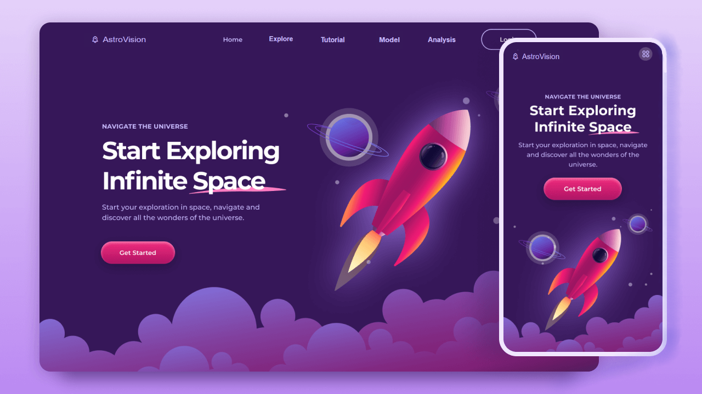

# 🌌 AstroVision

  

# 🌌 AstroVision
Welcome to **AstroVision** — our official project for the **NASA Space Apps Challenge 2025** 🚀
Welcome to **AstroVision** — our official website for the NASA Space Apps Challenge 🚀  

🌍 **Website:** [https://amr-kzf.github.io/AstroVision/](https://amr-kzf.github.io/AstroVision/)  
📱 **Android App:** `AstroVision.apk` (available in this repository)

📱 **Our trained *AI model* is located in the folder:** `📂 streamlit_nasa_project_new` (available in this repository)

## 🧠 Model Instructions

To learn how to run the AI model locally using Streamlit, check the detailed guide below 👇  

➡ [Open Model README (HTML)](streamlit_nasa_project_new/ReadMe.html) open it locally on your device — double-click the file or drag it into your browser.)  

o run the model locally, follow these steps:

1. Open the terminal inside your project folder.
2. Create a virtual environment:
   python -m venv .venv
3. Activate the virtual environment:
   .venv\Scripts\activate
   (After activation, you’ll see (.venv) at the beginning of your terminal line.)

4. Install the required libraries from requirements.txt:
   pip install -r requirements.txt

5. Run the application using Streamlit:
   streamlit run main.py

The browser will open automatically showing the local URL (localhost) where the app runs.  
If it doesn’t open, copy the link from the terminal and paste it into your browser.

Notes:
- To deactivate the virtual environment:
  deactivate
- Each time you want to run the project, activate the .venv environment first.
- Ensure the model files are in the correct directory:
  models/final_catboost_model_for_kepler.pkl
  models/best_model_lightcurve.h5

Project Structure:
  main.py                 → Main Streamlit application
  models/                 → Saved models
  requirements.txt        → Required dependencies
  README.html             → Full detailed usage guide

To view the HTML version of this guide:
- Open the folder: streamlit_nasa_project_new
- Double-click the file: README.html
- It will open in your default browser as a formatted document.

AstroVision is a space science visualization project that brings NASA data to life through interactive dashboards, self-learning modules, and AI-powered insights about exoplanets and the universe beyond. ✨  

---

### 👩‍🚀 Team AstroVision
Part of the **NASA Space Apps Challenge 2025 **  
Created with passion for exploration, innovation, and science. 💫
